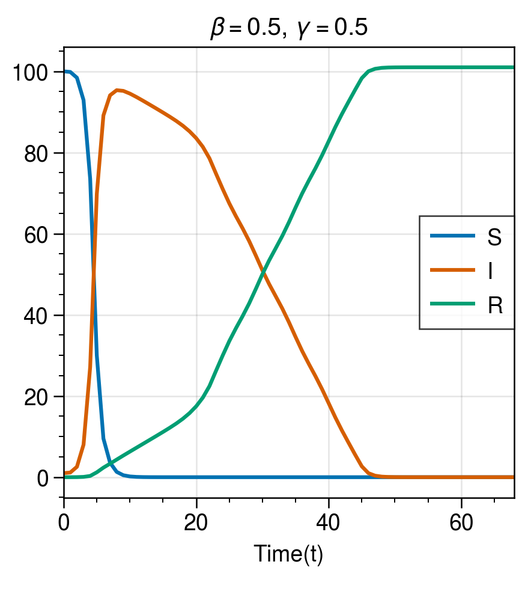

<!-- markdown-toc start - Don't edit this section. Run M-x markdown-toc-refresh-toc -->
**Table of Contents**
- [How To Model a Disease?](#how-to-model-a-disease)
- [Population dynamics](#population-dynamics)
    - [But wait what is $S(t), I(t)$, and $R(t)$?](#but-wait-what-is-st-it-and-rt)
    - [Why is this useful?](#why-is-this-useful)
- [:memo: Task: implement the equations and simulate the SIR model ](#memo-task-implement-the-equations-and-simulate-the-sir-model)
- [:memo: Task: simulate the peak and width of the curve as a function of $R_0$  ](#memo-task-simulate-the-peak-and-width-of-the-curve-as-a-function-of-r_0)

<!-- markdown-toc end -->


<a id="org69df47c"></a>

# How To Model a Disease?

The SIR model is one of the simplest models to study the dynamics of a disease. In this model, the complex kinetics or particles are ignore. Instead, a disease is modeled by considering the rates between different stages. In particular, the SIR model consists of the transition between

```math
Susceptible \to Infected \to Recovered
```

The population on this change is dependent on the rate of change that transforms, say, a susceptible individual to an infected individual. The model assumes that the transmission only depends on the contact rate between infected and susceptible. Recovered individuals are immune to the disease and cannot transmit the disease. The rate of change from a susceptible individual to an infected individual is dependent on three things: the rate of contact between susceptible and infected, the probability of an infected individual transmitting the disease to another individual, and the recovery rate of an individual. The rate of infection is often denoted as $\beta$, and the rate over recovery is often $\gamma$.


<a id="orgee5a59b"></a>

# Population dynamics

Before we introduce complicated dynamics, it warrants to explore the dynamics of the simple model. Let&rsquo;s assume we a have population of size $N$ that remains fixed over time. That is, $\frac{d}{dt} N = 0$ and $N = S + I + R$ where $S,I,R$ denotes the number of individuals that are susceptible, infected, and recovered respectively. Can we get an expression that tells us how a disease spreads through society? It turns out we can!

If we think about the three populations, we see that $S$ is only dependent on $I$, in turn $I$ depends on $S$ and $I$ itself. Lastly, $R$ is only determined by $I$. Let&rsquo;s first focus on $S$. The change of dynamics as a function of time (denoted by $\frac{d}{dt}S$) is determined by 1 thing and 1 thing only: the rate of infection of $I$ population. That is, the dynamics of the $S$ compartment depends on how often $S$s are in contact with $I$ and how well the disease *turns* $S$ into $I$. Or in other words we can write that the change of $S$ is described by

```math
\frac{dS}{dt}  = -\beta S(t) I(t).
```

The interaction $S(t)I(t)$ tells us that the dynamics of $S$ is proportional to the interactions of $S$s with $I$s. The negative sign indicates that our population can only shrink &#x2013; since we have no birth/death dynamics.

When we think of the dynamics of $I$, we can state that the change of the number of $I$s over time is determined by the &ldquo;gain&rdquo; or &ldquo;success&rdquo; of the infected people turning $S \to I$. This rate is the same (but opposite) of the loss of $S \to I$. Furthermore, the $I$ population &ldquo;shrinks&rdquo; when the infected individuals turn form $I \to R$. The rate of loss is determined by $\gamma$. Taken together we can write

```math
\frac{dI}{dt} = \beta S(t) I(t) - \gamma I(t).
```

Lastly, the dynamics of $R$ are only determined by the &ldquo;gain&rdquo; of $I\to R$, which is simply

```math
\frac{dR}{dt}  = \gamma I(t).
```

Taken together our system $\sigma = \{S, I, R\}$ is described over time as

```math
\begin{aligned}
\frac{dS}{dt} &= -\beta S(t) I(t) \\
\frac{dI}{dt} &= \beta S(t) I(t) - \gamma I(t)\\
\frac{dR}{dt} &= \gamma I(t)
\end{aligned}
```

Neat!


<a id="org473955d"></a>

## But wait what is $S(t), I(t)$, and $R(t)$?

Now that we have a compact expression for the dynamics of the different compartments, we still have to determined what these time functions are. The systems of equations express the change of three different subpopulations over time, and are called coupled ordinary differential equations. They are coupled since there is a dependency between $S$ and $I$. Thus, to get a solution for the set of equation, we need to examine these two populations more closely. Implement the analytical SIR model.

Instead of solving each equation with respect to $t$ &#x2013; which can be complicated &#x2013; we take advantage of the interdependence. We can see that the temporal dependence &ldquo;drops&rdquo; out by considering the rate of change for $S$ *relative* to $R$, that is we consider

```math
\frac{\frac{d S(t)}{dt}}{\frac{dR(t)}{dt}} = \frac{-\beta S(t) I(t)}{\gamma I(t)}$$
```

which gives us

<a id="eq1"></a>
```math
\begin{equation} 
\frac{dI(t)}{dS(t)} = \frac{-\beta}{\gamma}S(t)
\end{equation}
```

The ratio $\frac{\beta}{\gamma}$ is often expressed as the **basic reproduction number** or $R_0 = \frac{\beta}{\gamma}$ which expresses the rate of spreading a disease to its recovery rate.


<a id="org5777e1c"></a>

## Why is this useful?

-   **Simplicity**: Instead of solving a complex system of differential equations with respect to time, we now only need to deal with a single differential equation that directly relates $I(t)$ and $S(t)$.
-   **Analytical Insight**: By separating variables and integrating, we can derive an analytical relationship between $I(t)$ and $S(t)$, providing a clear picture of how these two quantities evolve relative to each other during an epidemic.
-   **Reduction of Complexity**: This step simplifies the problem by reducing it from a system of time-dependent differential equations to a single, more tractable equation.

Equation [eq:1](#eq1) can solved by integration


<a id="eq2"></a>
```math
\begin{equation} 
\begin{aligned}
\int\frac{dS(t)}{dR(t)} dS(t) &= -\frac{\beta}{\gamma} S(t) \leftrightarrow \frac{dS}{S(t)} = -\frac{\beta}{\gamma}\\
\int_0^\tau \frac{d S(t)}{S(t)} &= \frac{\beta}{\gamma} dR(t)\\
\ln S(t) - \ln S(0) &= -R_0 (R(t) - R(0))\\
S(t) &= S_0 e^{-R_0(R(t) - R(0))}
\end{aligned}
\end{equation}
```

We now have an expression for the time evolution of $S$ in terms of $R$. So why go through all this trouble? The equation shows that the number of susceptibles can expontially descrease with $R_0$. If $R_0$ is above 1, we _exponentially_ fast lose susceptibles. 

The exact solution to this system is a bit more involved and goes outside the scope of this tutorial session, but if interested I can point you to some interesting articles. The beauty of the SIR model is that it is so simple that the solution seems at reach, yet the math quickly gets more involved, and sometimes even impossible to solve. We will explore a potential solution to this problem in parts two and three of this tutorial session where we will implement the SIR model on a network (part 2) that potentially changes as a function of time (part 3).

<a id="orgebed299"></a>

# :memo: Task: implement the equations and simulate the SIR model 
Given the explanation above, implement the SIR model as an ODE. Make use of \`scipy.integrate.solve\_ivp\` and plot the evolution of the SIR model as a function of time. You should in the end have something like this



Things to try:

- How does the reproduction number influence the number of infected people?
- What happens when you double the infection rate?
- What happens when you half the infection rate?
- What happens when..
    - The basic reproduction number is above 1?
    - The basic reproduction number is below 1?

<a id="org98017b6"></a>

# :memo: Task: simulate the peak and width of the curve as a function of $R_0$  

Simulate the SIR dynamic under different rates of $\gamma$ and $\beta$. Create a heatmap of the peak and width of the infected population after $t=100$ time steps, start with an initial population of where one person is infected. Under which parameter settings does the disease spread most readily?


